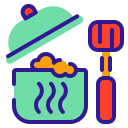
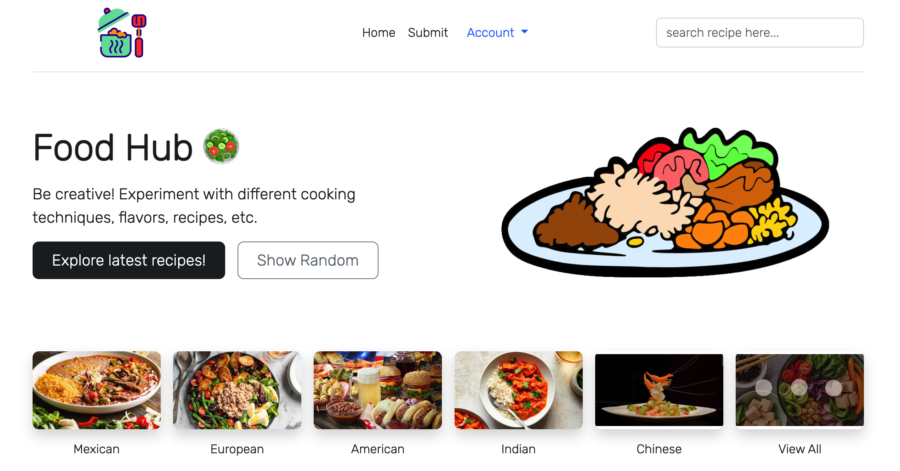

# Foodhub



Foodhub is a recipe sharing web app that lets users find recipes from all over the world and share recipes of their own. With features like a searchbar, tags on recipes for different cuisines, and even a random recipe button, users can easily find recipes for familiar foods or branch out and try new dishes. Users can interact with recipes they love with likes and comments, as well as post recipes of their own to share with the world.



# Quick setup instructions
------------------------

In order to start the project, please download and install Node.js first:  
Download on mac:  https://nodejs.org/en/  
Download on windows: https://nodejs.org/en/download/  


Clone the repository here and enter the `/recipes/` directory.


### `npm install`
To install required packages for our web app.


### `npm start`
This will run an instance on `localhost:3000` which you can put into a browser. 

# IMPORTANT!!!
Our web app must be running under a private network connection!  
Since Mongoose may not be stable under public network connection, data might not be properly read/written using some public network such as UCLA_WEB.
A private connection such as personal wifi or mobile hotspot is required.

## If npm install fails

If npm install fails, you can install the packages individually using the following commands:
```
npm install nodemon
npm install mongoose
npm install axios
npm install express-ejs-layouts
npm i passport
npm install passport-local
npm install passport-local-mongoose
npm install express-session
```
